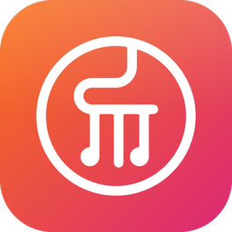
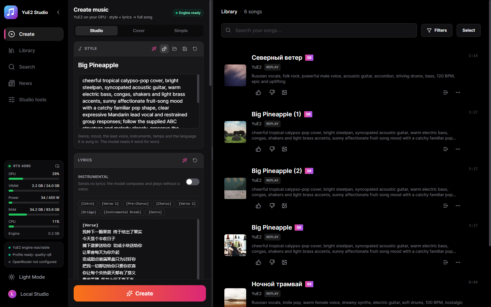
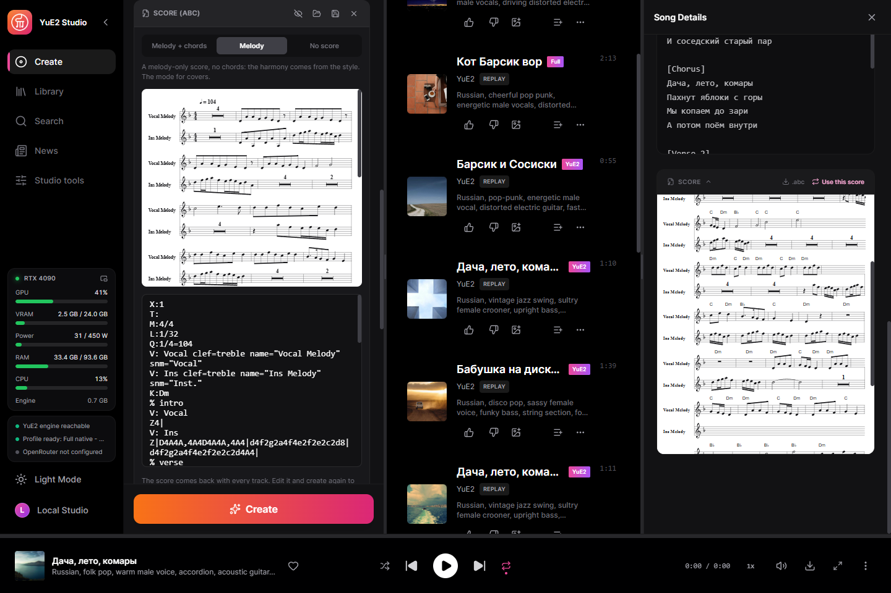
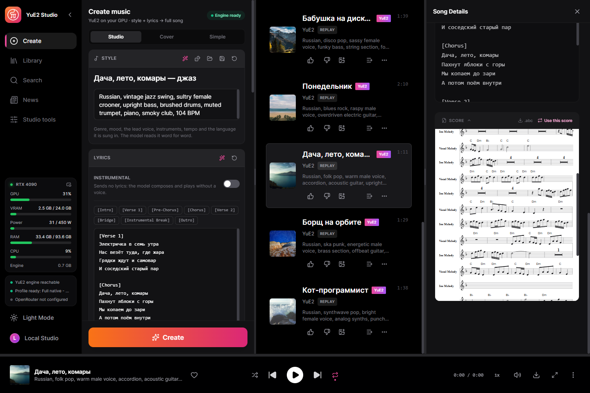
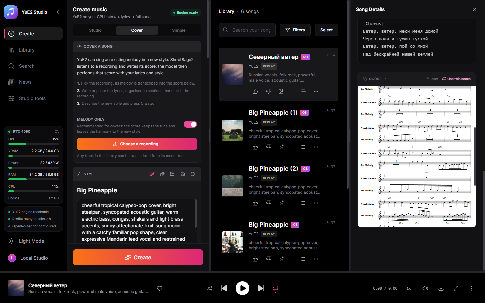
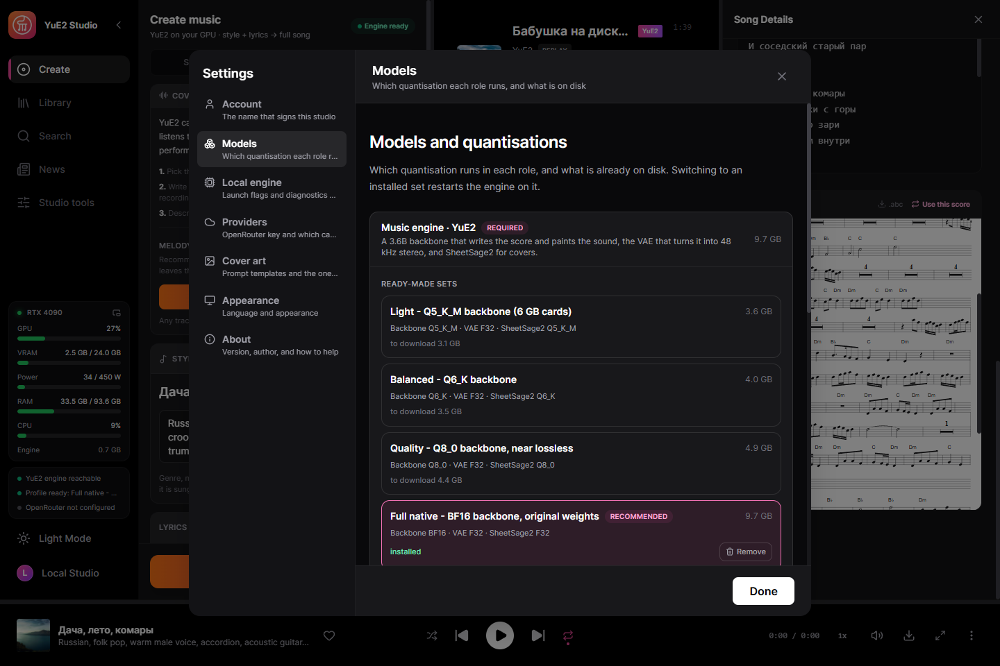
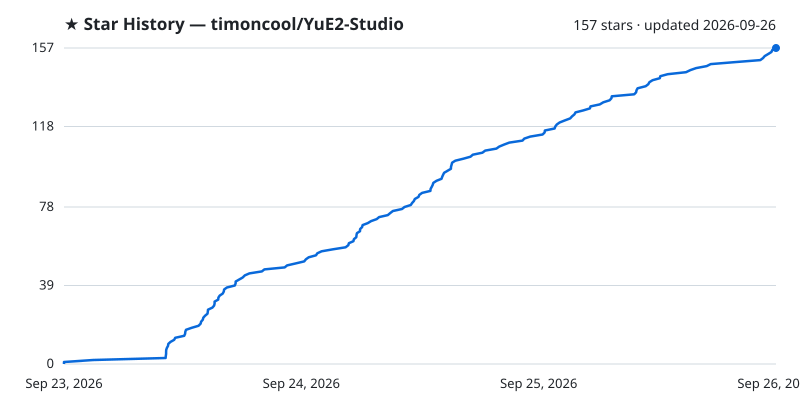

<div align="center">



# YuE2 Studio

**Full songs with an editable score, generated on your own GPU. One executable — no Python, no Node.js, no launcher.**

[](https://timoncool.github.io/YuE2-Studio/)
[](https://github.com/timoncool/YuE2-Studio/releases/latest)
[](DONATE.md)

[](LICENSE)
[](https://github.com/timoncool/YuE2-Studio/stargazers)
[](https://github.com/timoncool/YuE2-Studio/commits/main)
[](https://github.com/timoncool/YuE2-Studio/releases)

**English** · [Русский](https://timoncool.github.io/YuE2-Studio/ru.html) · [中文](https://timoncool.github.io/YuE2-Studio/zh.html) · [日本語](https://timoncool.github.io/YuE2-Studio/ja.html) · [한국어](https://timoncool.github.io/YuE2-Studio/ko.html)



</div>

YuE2 Studio is a desktop studio for **YuE2**, the open song model from M-A-P that writes a
score before it sings. Describe a style, write the lyrics, and the model composes a melody
with chords as sheet music, then performs it as a full song with vocals. The score comes
back with the track: read it, edit it, and render the same composition again with a
different sound. Windows installer with auto-update or a portable folder, runs offline on
an NVIDIA card with 6 GB of VRAM or more; AMD and Intel cards through Vulkan are experimental.

It is built on [yue2.cpp](https://github.com/ServeurpersoCom/yue2.cpp), the native C++/CUDA
port of YuE2. The studio around it is Rust and React in a Tauri window — nothing in the
runtime path is Python.

## What you can do

- **Full songs from a style and lyrics** — up to six minutes, in the languages the model
  sings. On an RTX 4090 with the Q8_0 set a 3:38 song renders in about 46 seconds.
- **Read and edit the score** — the model writes its composition in ABC notation first; the
  studio engraves it as sheet music. Edit the notes, tempo or key and create again: the
  composition stays, the performance changes. Or switch to melody-only, or no score at all.
- **Compose the score first** — write only the score from the style and lyrics, without
  singing it (the studio's take on yue2.cpp's `yue-plan`), read and fix it, then create.
- **Covers** — SheetSage2 listens to any recording and writes its melody as a score; YuE2
  then sings that melody with your lyrics in your style. A track from your library can be
  transcribed from its menu.
- **Exact replay** — every track keeps its request and its audio codes, so it can be
  re-rendered bit for bit, or re-rendered with other steps, a new sound seed, several
  variations, or another output format, without composing again.
- **110 ready examples** — the style/lyrics/score sets that ship with yue2.cpp, covers
  included, one click to load.
- **Every engine setting** — all seven sampling knobs (temperature, top-p, top-k,
  repetition penalty and its window, minimum and maximum tokens) for the score and for the
  audio codes, flow-matching steps, guidance, both seeds, peak normalisation, MP3 or
  16/24/32-bit WAV. Prompts open and save as JSON or YAML in the engine's own request
  format, so they move freely between the studio, the yue2.cpp WebUI and `yue-synth`.
- **A writing assistant** — a local Gemma model or OpenRouter writes the style and lyrics
  from an idea and edits the score on request.
- **Word-level karaoke** — enhanced LRC with a timestamp on every word, aligned by Parakeet
  or Whisper. Your lyrics are kept; only the timing is borrowed.
- **Six stems on the GPU** — drums, bass, other, vocals, guitar and piano with HT-Demucs.
- **A library of plain files** — search, playlists, cover art from prompt templates, MP3s
  exported with title, lyrics and cover in their ID3 tags. Interface in English, Russian,
  Chinese, Japanese and Korean.

## Screenshots

| | |
|---|---|
|  |  |
| The score as sheet music and as ABC text — melody + chords, melody only, or none | A finished track — its lyrics and the score it was sung from, ready to reuse |
|  |  |
| Cover mode — pick a recording, SheetSage2 writes its melody down | Model sets — one quantisation per role, what is on disk, switch in one click |

The same screens in the language you read: [Русский](https://timoncool.github.io/YuE2-Studio/ru.html),
[中文](https://timoncool.github.io/YuE2-Studio/zh.html), [日本語](https://timoncool.github.io/YuE2-Studio/ja.html),
[한국어](https://timoncool.github.io/YuE2-Studio/ko.html) — on the project page, or in
[docs/screenshots](docs/screenshots).

## What it needs

- Windows 10/11 x64.
- A GPU with **6 GB of VRAM** or more:
  - **NVIDIA**, GTX 16 / RTX 20 generation or newer (Turing through Blackwell), runs on
    CUDA — the fastest path. Pascal and older are not supported by the CUDA 13 toolkit.
  - **AMD or Intel — experimental.** The engine runs on Vulkan through the card's own
    driver. The Vulkan path itself is verified on NVIDIA (the same words heard as on
    CUDA), but on AMD Radeon integrated graphics the song came out with unintelligible
    vocals, and discrete AMD and Intel cards are untested. Reports from owners are welcome.
  - Without a GPU the engine falls back to the processor, which works but is many times
    slower.
- 4–10 GB of disk for one model set.

## Quick start

1. **Install** — run `YuE2.Studio_x.y.z_x64-setup.exe` from the
   [latest release](https://github.com/timoncool/YuE2-Studio/releases/latest), or unzip the
   portable archive anywhere and run `YuE2-Studio.exe`.
2. **Choose a model set** — the first screen preselects the set your card can run. Press
   download; it fetches only what is missing and resumes if interrupted.
3. **Create** — write a style and lyrics, or load one of the examples, and press Create.
   The engine starts by itself and the song lands in your library with its score.

The installed version updates itself: a new release is offered inside the studio and
installed in place. The portable version keeps everything — models, songs, settings —
inside its own folder.

## Models

A runnable YuE2 installation is a **backbone** (the 3B model that writes the score and the
audio codes) and the **VAE** (turns them into 48 kHz stereo). **SheetSage2** is optional:
without it the studio generates, but cannot transcribe recordings for covers.

| Your GPU | Set | Download |
| --- | --- | --- |
| 12 GB VRAM and above | Full native — BF16 backbone, original weights | 9.7 GB |
| 8 GB and above | Quality — Q8_0 backbone, near lossless | 4.9 GB |
| 7 GB and above | Balanced — Q6_K backbone | 4.0 GB |
| 5.5 GB and above | Light — Q5_K_M backbone | 3.6 GB |

Sizes include SheetSage2 at the matching quantisation. The studio detects your card and
preselects the set, but the download is always your decision; the model manager also builds
a custom mix role by role. Q5_K_M is the lightest quantisation published for YuE2.

All files come from [Serveurperso/YuE2-GGUF](https://huggingface.co/Serveurperso/YuE2-GGUF),
pinned to revision `64b030e`, and are checked by size and SHA-256. They are written to, and
can be dropped into by hand at:

- **Installed:** `%LOCALAPPDATA%\YuE2 Studio\models\yue2-cpp\`
- **Portable:** `<the folder you unzipped>\data\models\yue2-cpp\`

A file placed by hand with the exact catalogue name is recognised and never downloaded again.

<details>
<summary><b>Every file, with direct download links</b></summary>

| File | Role | Size |
| --- | --- | --- |
| [`YuE2-3B-BF16.gguf`](https://huggingface.co/Serveurperso/YuE2-GGUF/resolve/64b030e3deb6e8150d2b7c0db641ef5a17eca8a3/YuE2-3B-BF16.gguf) | backbone | 6.67 GB |
| [`YuE2-3B-Q8_0.gguf`](https://huggingface.co/Serveurperso/YuE2-GGUF/resolve/64b030e3deb6e8150d2b7c0db641ef5a17eca8a3/YuE2-3B-Q8_0.gguf) | backbone | 3.55 GB |
| [`YuE2-3B-Q6_K.gguf`](https://huggingface.co/Serveurperso/YuE2-GGUF/resolve/64b030e3deb6e8150d2b7c0db641ef5a17eca8a3/YuE2-3B-Q6_K.gguf) | backbone | 2.74 GB |
| [`YuE2-3B-Q5_K_M.gguf`](https://huggingface.co/Serveurperso/YuE2-GGUF/resolve/64b030e3deb6e8150d2b7c0db641ef5a17eca8a3/YuE2-3B-Q5_K_M.gguf) | backbone | 2.44 GB |
| [`YuE2-Vae-F32.gguf`](https://huggingface.co/Serveurperso/YuE2-GGUF/resolve/64b030e3deb6e8150d2b7c0db641ef5a17eca8a3/YuE2-Vae-F32.gguf) | VAE, every set | 506 MB |
| [`SheetSage2-F32.gguf`](https://huggingface.co/Serveurperso/YuE2-GGUF/resolve/64b030e3deb6e8150d2b7c0db641ef5a17eca8a3/SheetSage2-F32.gguf) | transcriber | 2.52 GB |
| [`SheetSage2-Q8_0.gguf`](https://huggingface.co/Serveurperso/YuE2-GGUF/resolve/64b030e3deb6e8150d2b7c0db641ef5a17eca8a3/SheetSage2-Q8_0.gguf) | transcriber | 913 MB |
| [`SheetSage2-Q6_K.gguf`](https://huggingface.co/Serveurperso/YuE2-GGUF/resolve/64b030e3deb6e8150d2b7c0db641ef5a17eca8a3/SheetSage2-Q6_K.gguf) | transcriber | 776 MB |
| [`SheetSage2-Q5_K_M.gguf`](https://huggingface.co/Serveurperso/YuE2-GGUF/resolve/64b030e3deb6e8150d2b7c0db641ef5a17eca8a3/SheetSage2-Q5_K_M.gguf) | transcriber | 703 MB |

</details>

## The engine and the DLLs it needs

```text
yue-server.exe → ggml.dll, ggml-base.dll            shipped inside the app
  loads at run time, whichever the machine can use:
  ├─ ggml-cuda.dll     → cublas64_13.dll, cublasLt64_13.dll (downloaded once), nvcuda.dll (NVIDIA driver)
  ├─ ggml-vulkan.dll   → vulkan-1.dll (every AMD, Intel and NVIDIA driver)
  └─ ggml-cpu-*.dll    nine builds, from SSE4.2 to AVX-512; the best one for the processor is picked
  + vcruntime140.dll, msvcp140.dll                   Visual C++ runtime
```

**Shipped inside the app.** `yue-server.exe` and every `ggml*.dll`, built from the pinned
yue2.cpp commit with all backends, live in `resources\yue2-cpp\` beside the main
executable. Settings → Local engine chooses the compute device: Auto (CUDA on NVIDIA,
Vulkan on AMD and Intel, the processor without a GPU), or CUDA, Vulkan or the processor
explicitly. On Vulkan the studio turns on the engine's FP16 clamp: without it AMD Radeon
integrated graphics rendered pure silence and the engine crashed encoding it.

**Downloaded once, on the first engine start — on NVIDIA only.**

| File(s) | Where from | Size | Why |
| --- | --- | --- | --- |
| `cublas64_13.dll`, `cublasLt64_13.dll` | NVIDIA's redistributable [`libcublas-windows-x86_64-13.5.1.27-archive.zip`](https://developer.download.nvidia.com/compute/cuda/redist/libcublas/windows-x86_64/libcublas-windows-x86_64-13.5.1.27-archive.zip) | 391 MB (zip) | The CUDA linear algebra `ggml-cuda.dll` is linked against; too large, and under NVIDIA's licence, to bundle. |
| Visual C++ 2015–2022 runtime | Microsoft's [`vc_redist.x64.exe`](https://aka.ms/vs/17/release/vc_redist.x64.exe) | small | Installed only when the DLLs are missing. |

A machine with the CUDA 13 toolkit already has cuBLAS on its `PATH` and downloads nothing.
Behind a proxy, take the two DLLs from the archive's `bin\` folder and drop them next to
`yue-server.exe`; the studio finds and uses them.

## Architecture

```text
React UI ─┐
          ├─ YuE2-Studio.exe   (Tauri window + Rust/Axum service on 127.0.0.1:8791)
Rust axum ┘        │
                   └─ yue2.cpp `yue-server`   (C++/CUDA, GGUF, 127.0.0.1:18087)
```

The service is compiled into the desktop binary. It supervises the engine process, restarts
it when you switch model sets, and imports finished songs itself, so a result is never lost
if the window was reloaded or closed mid-generation. Progress is read from the engine's own
log: score, audio codes, acoustic rendering, decoding.

## Building from source

```powershell
npm --prefix app install
npm --prefix desktop install
cargo test --workspace
npm --prefix app test
```

Developing the UI against a running service:

```powershell
cargo run -p music-server           # service on 127.0.0.1:8791
npm --prefix app run dev            # UI on 127.0.0.1:3791
```

The engine: `scripts/build-yue-runtime.ps1 -RuntimeBackend all` builds the pinned yue2.cpp
commit (`engines/yue2-cpp-source.json`) with runtime-loaded CUDA, Vulkan and CPU backends,
using CUDA 13, the Vulkan SDK, MSVC and Ninja. `scripts/build-release.ps1 -Version X.Y.Z` produces the NSIS installer, the
portable archive and the signed `latest.json` for the updater; it reads the signing key from
`TAURI_SIGNING_PRIVATE_KEY` or `%USERPROFILE%\.tauri\yue2-studio.key`. Model weights are
never part of a release.

yue2.cpp also builds for Linux and macOS (Metal); the studio's release pipeline ships the
Windows build with CUDA, Vulkan and CPU backends for now.

## Other Projects by [@timoncool](https://github.com/timoncool)

| Project | Description |
|---------|-------------|
| [MiniMax Music3 Studio](https://github.com/timoncool/MiniMax-Music3-Studio) | The same studio on MiniMax Music3 — the one this grew out of |
| [ACE-Step Studio](https://github.com/timoncool/ACE-Step-Studio) | AI music studio — songs, vocals, covers, videos |
| [Foundation Music Lab](https://github.com/timoncool/Foundation-Music-Lab) | Music generation + timeline editor |
| [VibeVoice ASR](https://github.com/timoncool/VibeVoice_ASR_portable_ru) | Portable speech recognition |
| [Qwen3-TTS](https://github.com/timoncool/Qwen3-TTS_portable_rus) | Portable text-to-speech with voice cloning |
| [telegram-api-mcp](https://github.com/timoncool/telegram-api-mcp) | Full Telegram Bot API as an MCP server |

## Authors

- **Nerual Dreming** — [Telegram](https://t.me/nerual_dreming) | [neuro-cartel.com](https://neuro-cartel.com) | [ArtGeneration.me](https://artgeneration.me)
- **Нейро-Софт** — [Telegram](https://t.me/neuroport) | portable neural networks

## Acknowledgements

- [M-A-P](https://huggingface.co/m-a-p) for YuE2-3B, the YuE2 VAE and SheetSage2.
- [Serveurperso](https://github.com/ServeurpersoCom) for yue2.cpp, its examples and the GGUF conversions.

## Support the Author

I build open-source software and do AI research. Most of what I create is free and available to everyone. Your donations help me keep creating without worrying about where the next meal comes from =)

**[All donation methods](DONATE.md)** · [Русский](DONATE.ru.md) · [中文](DONATE.zh.md) · [日本語](DONATE.ja.md) · [한국어](DONATE.ko.md) | **[dalink.to/nerual_dreming](https://dalink.to/nerual_dreming)** | **[boosty.to/neuro_art](https://boosty.to/neuro_art)**

- **BTC:** `1E7dHL22RpyhJGVpcvKdbyZgksSYkYeEBC`
- **ETH (ERC20):** `0xb5db65adf478983186d4897ba92fe2c25c594a0c`
- **USDT (TRC20):** `TQST9Lp2TjK6FiVkn4fwfGUee7NmkxEE7C`

## Star History

<a href="https://github.com/timoncool/YuE2-Studio/stargazers">
 <picture>
   <source media="(prefers-color-scheme: dark)" srcset="docs/stars-dark.svg" />
   <source media="(prefers-color-scheme: light)" srcset="docs/stars-light.svg" />
   
 </picture>
</a>

## License

The studio is MIT, and so is yue2.cpp. **The models are not:** YuE2-3B, the YuE2 VAE and
SheetSage2 are released under **CC BY-NC 4.0** — songs you make with them are for
non-commercial use unless you obtain other terms from their authors.

What changed and when is in [CHANGELOG.md](CHANGELOG.md).
